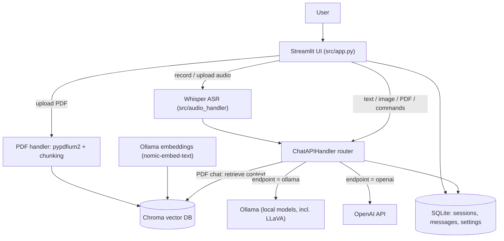

# Local Multimodal AI Chat

A self-hostable, multimodal chat application that runs open-source models locally. Chat with **text, images, PDFs, and voice** in one interface, powered by local models via **Ollama** (with an optional **OpenAI API** fallback), retrieval-augmented generation over your own PDFs, and speech-to-text with **Whisper**.

## Overview

Local Multimodal AI Chat integrates several AI models behind a single Streamlit interface, with a focus on **data privacy** (everything can run on your own machine) and **modularity** (each capability lives in its own handler).

- **Chat** with local models through the Ollama API, or switch to the OpenAI API at runtime.
- **Talk to your PDFs** via retrieval-augmented generation (RAG) backed by a Chroma vector database.
- **Send images** to vision-capable models (e.g. LLaVA).
- **Speak instead of type**: audio is transcribed with Whisper.
- **Keep your history**: chat sessions, messages, and settings are persisted in SQLite.

## Features

- **Local-first inference (Ollama):** run models on your own hardware, no cloud dependency required.
- **Optional OpenAI API:** switch endpoint and model at runtime from the sidebar.
- **PDF chat (RAG):** upload PDFs, chunk and embed them (Ollama `nomic-embed-text`), and query them through Chroma.
- **Image chat:** pass images to multimodal models via the same chat bar.
- **Voice input (Whisper):** record or upload audio; it is transcribed and fed into the conversation.
- **Persistent, multi-session history:** SQLite-backed sessions, messages (text/image/audio), and user settings.
- **Configurable retrieval:** adjust chunk size, overlap, retrieved-chunk count, and chat-memory length in the UI.
- **Dockerized:** `docker compose up` for the full stack, with a variant for a local Ollama install.

## Architecture



**Module layout**

All Python source lives under `src/`.

| File | Responsibility |
|------|----------------|
| `src/app.py` | Streamlit UI, session state, orchestration |
| `src/chat_api_handler.py` | Endpoint router (Ollama / OpenAI), text + image + RAG calls |
| `src/vectordb_handler.py` | Chroma client + Ollama embeddings |
| `src/pdf_handler.py` | PDF text extraction, chunking, indexing |
| `src/audio_handler.py` | Whisper transcription (webm→wav via ffmpeg) |
| `src/database_operations.py` | SQLite repositories (messages, settings) |
| `src/utils.py` / `src/prompt_templates.py` / `src/html_templates.py` | Helpers, prompts, UI styling |

## Tech Stack

Python · Streamlit · Ollama · OpenAI API · LangChain · Chroma · Whisper (Transformers) · SQLite · Docker

## Getting Started

First, copy the example environment file and add your key only if you plan to use the OpenAI endpoint:

```bash
cp .env.example .env
# edit .env and set OPENAI_API_KEY=... (optional; leave empty for local-only use)
```

### Easiest and preferred: Docker Compose

1. **Set the model save path**: line 21 in `docker-compose.yml`.
2. **Start it**: `docker compose up`
   *No GPU? Remove the `deploy` section from the compose file.*
3. **Open the app**: [http://0.0.0.0:8501](http://0.0.0.0:8501)
4. **Pull models**: browse [ollama.com/library](https://ollama.com/library) and enter `/pull MODEL_NAME` in the chat bar. You need an embedding model (e.g. [nomic-embed-text](https://ollama.com/library/nomic-embed-text)) for PDFs and a vision model (e.g. [llava](https://ollama.com/library/llava)) for images.
5. **Optional**: adjust `config.yaml`; replace the avatars in `chat_icons/`.

### Recommendation for Windows

Running Ollama inside Docker is slow on Windows (system calls are translated between kernels). Install Ollama locally instead:

1. **Install [Ollama](https://ollama.com/download) desktop.**
2. Delete `docker-compose.yml` and rename `docker-compose_without_ollama.yml` to `docker-compose.yml`.
3. In `config.yaml`, use the `host.docker.internal` base URL (line 4) and remove line 3.
4. `docker compose up`, then open [http://0.0.0.0:8501](http://0.0.0.0:8501) and pull models as above.

### Complete manual install

1. **Install [Ollama](https://github.com/ollama/ollama).**
2. **Create a virtual environment** (developed on Python 3.10.12).
3. **Install requirements**:
   ```bash
   pip install --upgrade pip
   pip install -r requirements.txt
   pip install torch torchvision torchaudio --index-url https://download.pytorch.org/whl/cpu
   ```
4. **Run**:
   ```bash
   python3 src/database_operations.py   # initializes the SQLite database
   streamlit run src/app.py
   ```
5. **Pull models** as described above.

## Configuration

Key settings live in `config.yaml` (Ollama base URL and embedding model, Whisper model, Chroma path/collection, chat-sessions DB path). Runtime options (endpoint, model, chunk size/overlap, retrieved chunks, chat memory) are adjustable in the sidebar and persisted per user.

## Testing

A small contract-level test suite covers the SQLite layer, utility functions, and API request construction (UI, audio, and real model calls stay manual by design):

```bash
pip install -r requirements-dev.txt
pytest
```

Or run it inside the app container (no local Python setup, matches the CI environment):

```bash
docker compose -f docker-compose_without_ollama.yml run --rm app sh -c "pip install --no-cache-dir -q pytest && pytest"
```

